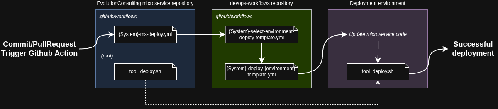

# Automatización de Despliegues con GitHub Actions  
## Evolution Consulting - DevOps Workflows

Este repositorio contiene la implementación del flujo de **automatización de despliegues** utilizado por los sistemas de **Evolution Consulting**, basado en **GitHub Actions** y **workflows reutilizables**.

El objetivo principal de esta solución es:
- Centralizar la lógica de despliegue
- Evitar duplicación de workflows en cada microservicio
- Facilitar el mantenimiento del flujo de CI/CD
- Permitir que nuevos microservicios se integren fácilmente al proceso de despliegue automático
- Garantizar trazabilidad y consistencia entre ramas y entornos

Este repositorio **no despliega directamente microservicios**, sino que actúa como un **repositorio central de plantillas DevOps**, consumidas por los distintos repositorios de la organización.

A lo largo del documento se utiliza el sistema **ECPAY2** como **ejemplo**, pero la arquitectura aplica a cualquier sistema de Evolution Consulting.

---

## 1. Relación entre ramas y entornos

Los sistemas de Evolution Consulting siguen un flujo de trabajo basado en **Gitflow**, donde cada rama principal del repositorio representa un entorno específico.

Ejemplo aplicado al sistema **ECPAY2**:

- **development**  
  Entorno local de la empresa (servidor en oficina).  
  Este entorno **no está automatizado**, ya que requiere autenticación manual mediante Tailscale y SSH.

- **staging**  
  Entorno de pruebas desplegado en una instancia **EC2 de AWS**.  
  **Automatizado** mediante GitHub Actions.

- **release**  
  Entorno productivo desplegado en una instancia **EC2 de AWS**, accedida a través de un **bastión**.  
  **Automatizado** mediante GitHub Actions.

Cada vez que se realiza un `push` o se acepta un Pull Request en alguna de estas ramas, se puede disparar automáticamente el flujo de despliegue correspondiente.

---

## 2. Enfoque general de la automatización

En lugar de definir un workflow completo en cada microservicio, se adoptó un enfoque **centralizado**:

- Cada microservicio contiene un workflow **mínimo**
- Toda la lógica de despliegue se encuentra en este repositorio (`devops-workflows`)
- Los microservicios **invocan plantillas reutilizables**
- La selección del entorno se realiza automáticamente según la rama que activó el workflow

De esta forma:
- Cambios en la lógica de despliegue se hacen en un solo lugar
- No es necesario modificar cada repositorio cuando el flujo cambia
- Se reduce el riesgo de configuraciones inconsistentes entre microservicios

---

## 3. Arquitectura de workflows

El flujo de despliegue está compuesto por **tres niveles de workflows**.

### 3.1 Workflow del microservicio

Cada microservicio debe contener un workflow ubicado en:

```
.github/workflows/{Sistema}-ms-deploy.yml
```
Donde `Sistema` corresponde al nombre del sistema (por ejemplo: `ECPAY2`).

Este workflow:
- Se ejecuta ante cualquier `push` al repositorio
- No contiene lógica de despliegue
- Únicamente invoca una plantilla reutilizable ubicada en `devops-workflows`

Este archivo puede ser **idéntico en todos los microservicios**.

**Ejemplo `ECPAY2-ms-deploy.yml`**

```yaml
name: ECPAY2 Deploy Microservice

on:
  push:

jobs:
  deploy:
    uses: Evolution-Consulting-SAS/devops-workflows/.github/workflows/ECPAY2-select-environment-deploy-template.yml@release
    secrets: inherit
```

**Nota:**  
Si se desea un control más granular (por ejemplo, solo ciertas ramas), esto puede ajustarse en este archivo.  
Sin embargo, la recomendación es mantener el control centralizado en el selector de entorno.

---

### 3.2 Selector de entorno

```
{Sistema}-select-environment-deploy-template.yml
```

Este workflow se encuentra en el repositorio `devops-workflows` y es el encargado de:

- Determinar desde qué rama se activó el workflow
- Decidir qué entorno debe desplegarse
- Invocar la plantilla de despliegue correspondiente

Para el sistema ECPAY2, este archivo es:

```
ECPAY2-select-environment-deploy-template.yml
```

Su responsabilidad principal es centralizar la relación rama → entorno, evitando que cada microservicio tenga que definir esta lógica.

**Ejemplo conceptual del flujo:**

```
rd_ecpay_reports_ms_v2
→ push a la rama staging
→ se ejecuta ECPAY2-ms-deploy.yml
→ se llama a ECPAY2-select-environment-deploy-template.yml
→ se detecta la rama staging
→ se ejecuta ECPAY2-deploy-staging-template.yml
```

**Ejemplo `ECPAY2-select-environment-deploy-template.yml`**
```yaml
name: ECPAY2 Select deploy environment template

on:
  workflow_call:
  
jobs:
  deploy_release:
    if: ${{ github.ref_name == 'release' }}
    uses: Evolution-Consulting-SAS/devops-workflows/.github/workflows/ECPAY2-deploy-release-template.yml@release
    secrets: inherit
    
  deploy_staging:
    if: ${{ github.ref_name == 'staging' }}
    uses: Evolution-Consulting-SAS/devops-workflows/.github/workflows/ECPAY2-deploy-staging-template.yml@release
    secrets: inherit

```
---

### 3.3 Workflow de despliegue por entorno

```
{Sistema}-deploy-{entorno}-template.yml
```

Para cada entorno existe una plantilla específica en `devops-workflows` que contiene los pasos técnicos del despliegue.

**Ejemplos en ECPAY2:**

- Entorno de pruebas (staging): `ECPAY2-deploy-staging-template.yml`
- Entorno productivo (release): `ECPAY2-deploy-release-template.yml`

Estas plantillas se encargan de:

- Conectarse al servidor correspondiente
- Navegar a la carpeta donde se encuentra el microservicio
- Actualizar el código desde GitHub (git pull)
- Ejecutar el script `tool_deploy.sh`
- Finalizar el despliegue

**Ejemplo `ECPAY2-deploy-staging-template.yml`**
```yaml
name: ECPAY2 Deploy to Staging EC2

on:
  workflow_call:
    secrets:
      EC2_TEST_HOST:
        required: true
      EC2_TEST_USER:
        required: true
      EC2_TEST_SSH_KEY:
        required: true

jobs:
  deploy:
    runs-on: ubuntu-latest

    steps:
      # --- Paso 1: Configurar variables útiles
      - name: Print context info
        run: |
          echo "Repo: ${{ github.event.repository.name }}"
          echo "Branch: ${{ github.ref_name }}"
          echo "Commit: ${{ github.sha }}"

      # --- Paso 2: Crear y proteger la llave privada temporal
      - name: Set up SSH key
        run: |
          echo "${{ secrets.EC2_TEST_SSH_KEY }}" > private_key.pem
          chmod 600 private_key.pem

      # --- Paso 3: Conectarse al servidor y ejecutar el despliegue
      - name: Deploy to EC2 (staging)
        env:
          REPO_NAME: ${{ github.event.repository.name }}
          BRANCH_NAME: ${{ github.ref_name }}
        run: |
          ssh -o StrictHostKeyChecking=no -i private_key.pem ${{ secrets.EC2_TEST_USER }}@${{ secrets.EC2_TEST_HOST }} << EOF
            set -e  # Terminar el script si algo falla

            echo "==> Conectado a la máquina de pruebas AWS"

            cd ~/ecpay/ECPAY2_RD/${REPO_NAME}

            echo "==> Actualizando código desde Git..."
            git fetch origin ${BRANCH_NAME}
            git checkout ${BRANCH_NAME}
            git pull origin ${BRANCH_NAME}

            echo "==> Asignando permisos de ejecución al script de despliegue..."
            chmod +x tool_deploy.sh

            echo "==> Ejecutando tool_deploy.sh..."
            ./tool_deploy.sh

            echo "==> Despliegue completado exitosamente"
          EOF

      # --- Paso 4: Limpieza de la llave privada
      - name: Clean up SSH key
        if: always()
        run: rm -f private_key.pem
```

⚠️ **IMPORTANTE**

Para que el flujo funcione correctamente en ECPAY2, es obligatorio que:

- El nombre del repositorio **coincida exactamente con** el nombre de la carpeta donde se encuentra el microservicio en el servidor de despliegue

Esto es necesario porque las plantillas de despliegue utilizan la variable:

```
github.event.repository.name
```

para localizar automáticamente la carpeta del microservicio en el servidor.

**Si los nombres no coinciden, el despliegue fallará.**

---

## 4. Script tool_deploy.sh

Este script debe ubicarse en la raíz del repositorio del microservicio.

Su responsabilidad es:

- Compilar o preparar el microservicio
- Levantar el contenedor correspondiente
- Ejecutar únicamente la lógica específica del microservicio

Este script:

- Se ejecuta desde la carpeta raíz del microservicio
- Asume que el `docker-compose.yml` del sistema se encuentra un nivel arriba
- Puede variar según la tecnología del microservicio (Java, Node, frontend, etc.)

**Ejemplo: rd_ecpay_reports_ms_v2 (SpringBoot)**

```bash
#!/bin/bash
# Script de deploy para rd_ecpay_reports_ms_v2
# Asume que se ejecuta desde la raíz del microservicio
# y que el docker-compose se encuentra en el directorio padre

sudo mvn clean package -DskipTests

cd ..

sudo docker-compose down reports_v2_service
sudo docker-compose build reports_v2_service
sudo docker-compose up -d reports_v2_service
```

**Requisitos importantes:**
* El nombre del servicio debe coincidir con el definido en el `docker-compose.yml`

---

## 5. Ejemplo completo del flujo de despliegue (ECPAY2)

1. Se acepta un Pull Request en la rama `staging`
2. GitHub dispara el workflow `ECPAY2-ms-deploy.yml`
3. Este workflow llama a `ECPAY2-select-environment-deploy-template.yml`
4. El selector detecta que la rama es `staging`
5. Se invoca `ECPAY2-deploy-staging-template.yml`
6. El workflow:
    - Se conecta al EC2 de pruebas
    - Navega a la carpeta del microservicio usando el nombre del repositorio
    - Ejecuta `git pull origin staging`
    - Ejecuta el script `tool_deploy.sh`
    - El contenedor actualizado queda desplegado
7. El proceso de despliegue finaliza exitosamente

### Diagrama del flujo de despliegue


## 6. Secretos (nivel Organización)

Para garantizar la **seguridad de la infraestructura** y evitar la exposición de credenciales sensibles en los repositorios, este flujo de automatización hace uso de **GitHub Secrets definidos a nivel de organización**.

El uso de secretos permite:

- Proteger claves privadas SSH
- Evitar exponer usuarios, hosts o llaves en texto plano
- Centralizar la gestión de credenciales de despliegue
- Facilitar la rotación de credenciales sin modificar workflows
- Reutilizar las mismas credenciales en múltiples repositorios y microservicios

Todos los workflows reutilizables definidos en este repositorio (`devops-workflows`) **asumen que los secretos existen previamente a nivel organización**, y que los repositorios consumidores heredan dichos secretos mediante la opción `secrets: inherit`.

### 6.1 Consideraciones de seguridad

- Las claves privadas **nunca** deben versionarse en los repositorios
- Los secretos solo deben ser visibles para los repositorios autorizados
- Se recomienda rotar las claves periódicamente
- Cualquier cambio en credenciales debe realizarse únicamente en los secretos de la organización, sin modificar los workflows

Este enfoque garantiza un flujo de despliegue **seguro, controlado y escalable** para todos los sistemas de Evolution Consulting.
